##### top
#  ``json-server`` 를 사용한 ``Mock Back End`` 만들기

* [01. ``json`` 파일을 사용한 ``json-server`` 만들기](#01)

* [02. ``js`` 파일을 사용한 ``json-server`` 만들기 - ``Object 반환형``](#02)

* [03. ``js`` 파일을 사용한 ``json-server`` 만들기 - ``json-server 객체형``](#03)

* [04. Mock 데이터 생성하기 - ``faker.js``](#04)

* [05. ``json-server`` 와 ``faker.js`` 연동하기](#05)

* [06. ``POST``, ``PUT``, ``DELETE`` 요청하기](#06)


<br/><hr/><br/>


##### 01
# 01. ``json`` 파일을 사용한 ``json-server`` 만들기

``json-server`` 라이브러리는 ``파일기반``의 ``Mock Back End 서버``를 제공 합니다.

> Github: [https://github.com/Chocobe/-Study-JsonServer](https://github.com/Chocobe/-Study-JsonServer)

<br/>

특별한 설정 없이, ``json`` 또는 ``js`` 파일을 사용하여 ``CLI`` 명령으로 ``Mock Back End`` 서버를 실행 시켜줍니다.


<br/><br/>


## 01-01. 설치

```bash
$ npm i -g json-server
```

또는

```bash
$ npm i --save-dev json-server
```


<br/><br/>


## 01-02. DB 파일 만들기 (``JSON``)

``json-server`` 는 ``json`` 또는 ``js`` 파일을 사용하여, ``Rest API`` 요청을 할 수 있는 ``Local Server``를 실행시켜 줍니다.

이 때 사용할 파일에는 ``Mock DB``를 만들어 주기만 하면 됩니다.

<br/>

 다음 코드는 ``Mock DB``로 사용할 ``myDB.json`` 입니다.

 ```json
{
  "users": [
    {
      "id": 1,
      "name": "Kim",
      "job": "Developer"
    },
    {
      "id": 2,
      "name": "John",
      "job": "Director"
    },
    {
      "id": 3,
      "name": "Bob",
      "job": "Teacher"
    }
  ]
}
 ```


<br/><br/>


## 01-03. ``Mock Back End`` 실행하기

터미널에 다음 명령을 사용하여, ``Mock Back End 서버``를 실행할 수 있습니다.

```bash
$ json-server myDB.json --watch --port 8001
```

<br/>

위 명령을 통해 서버가 실행되면, 다음과 같이 결과를 확인할 수 있습니다.

또한 Rest Full API 명령은 모두 요청할 수 있습니다.

<br/>

<br/>

<br/>


<br/>

[🔺 Top](#top)

<hr/><br/>


##### 02
# 02. ``js`` 파일을 사용한 ``json-server`` 만들기 - ``Object 반환형``

``js`` 파일을 사용한 ``json-server``의 경우, 두가지 방법이 있습니다.

1. DB를 구성하는 ``Object`` 반환형 함수로 만들기
2. ``json-server`` 객체를 사용하여 만들기

<br/>

이번 챕터에서는 ``Object`` 반환형 함수를 알아보겠습니다.


<br/><br/>


## 02-01. ``json-server`` 실행파일 만들기 - ``myGenerator.js``

``myGenerator.js`` 파일에는 ``module.exports`` 로 ``함수``를 반환할 것입니다.

이 ``함수``는 DB에 대한 ``Object``를 반환하는 함수 입니다.

<br/>

아래 코드는 ``users``와 ``dept`` 테이블을 나타낸 ``Object``를 반환하는 ``json-server`` 실행파일 입니다.

```javascript
module.exports = () => ({
  users: [
    {
      id: 1,
      name: "Kim",
      job: "Programmer",
    },
    {
      id: 2,
      name: "John",
      job: "Director",
    },
  ],
});
```

<br/>

위에서 작성한 ``myGenerator.js``를 사용하여 ``json-server``를 실행해 보겠습니다.

터미널에 다음 명령을 실행 합니다.

```bash
$ json-server myGenerator.js
```

<br/>

정상적으로 실행되면, 다음과 같은 결과를 확인할 수 있습니다.

<br/>

<br/>

<br/>

<br/>

(위의 ``js`` 방식은 ``json`` 방식과 거의 동일한 방식으로 작성할 수 있습니다.)


<br/>

[🔺 Top](#top)

<hr/><br/>


##### 03
# 03. ``js`` 파일을 사용한 ``json-server`` 만들기 - ``json-server 객체형``

이번에 알아볼 방법은 ``json-server`` 객체를 생성하여, 직접 ``JsonServer``를 실행하는 방법을 알아보겠습니다.

이 방법을 사용하게 되면, ``json-server``의 세부 설정이나 ``middleware``설정을 할 수 있습니다.


<br/><br/>


## 03-01. ``json-server`` 실행파일 만들기 - ``myDetailGenerator.js``

이번에 만들 ``myDetailGenerator.js``는 이전에 만들었던 ``myGenerator.js``와 큰 차이점이 하나 있습니다.

``CLI``에서 명령을 할 때, ``json-server``를 사용하는 것이 아닌, ``node``를 직접 사용합니다.

이 뜻은, ``js``파일 자체에 ``json-server``의 실행 로직을 모두 만든다는 것입니다.

<br/>

``json-server``의 핵심 메서드는 다음과 같습니다.

* ``JsonServer.create()``: 새로운 서버 객체를 생성합니다.
* ``JsonServer.use(사용할 객체)``: 서버 객체에서 사용할 객체를 등록 합니다.
* ``JsonServer.listener(포트번호, callback)``: 서버의 실행 포트 및 서버 실행 시 호출한 ``callback``을 설정 합니다.

<br/>

다음 코드는 ``myDetailGenerator.js`` 입니다.

``myDetailGenerator.js``는 ``json-server``를 실행하는 함수를 ``IIFE``로 실행하도록 만들 것입니다.

(이전에 사용했던 ``myDB.js``는 ``IIFE``에서 설정할 것입니다.)

```javascript
(function () {
  const path = require("path");
  const jsonServer = require("json-server");
  
  // 서버 생성
  const server = jsonServer.create();
  // 실행할 Port 번호
  const port = 8005;

  // json-server 의 middlewares 생성 (기본설정)
  const middlewares = jsonServer.defaults();
  // json-server 의 router 생성 (myDB.json 파일 사용)
  const router = jsonServer.router(path.join(__dirname, "myDB.json"));

  // 서버에 middlewares 등록
  server.use(middlewares);
  // 서버에 router 등록
  server.use(router);

  // 서버 실행 시, 주소 출력
  printState(port);

  // 서버의 실행 Port 설정 및 실행 완료 callback 설정
  server.listen(port, () => {
    console.log("Json Server is running");
  });
})();

// 서버 실행 시, 주소 출력 메서드
function printState(port) {
  console.log("\n*************************************");
  console.log("*                                   *");
  console.log(`*    URL: http://localhost:${port}     *`);
  console.log("*                                   *");
  console.log("*************************************\n");
}
```

<br/>

위와 같이 ``myDetailGenerator.js`` 를 작성한 후, 다음 CLI 명령을 실행 합니다.

```bash
$ node myDetailGenerator.js
```

<br/>

정상 실행이 되면, 다음과 같은 결과를 확인할 수 있습니다.

<br/>

<br/>

<br/>


<br/>

[🔺 Top](#top)

<hr/><br/>


##### 04
# 04. Mock 데이터 생성하기 - ``faker.js``

``faker.js`` 라이브러리는 Mock 데이터를 생성해 줍니다.

원하는 Property별 메서드를 제공하고 있어서, Property에 맞는 값을 생성할 수 있습니다.


<br/><br/>


## 04-01. ``faker.js`` 로 ``이름`` 생성하기

다음 CLI 명령을 통해 ``faker.js``를 설치 합니다.

```bash
$ npm i faker
```

<br/>

이제 설치한 ``faker.js``를 사용하여, Mock 데이터를 만들고 ``console.log()``로 출력해 보겠습니다.

다음은 예시 코드인 ``myFaker.js`` 파일 입니다.

```javascript
(function() {
  const faker = require("faker");
  const fullName = faker.fake("{{name.middleName}} {{name.lastName}}, {{name.firstName}}");
  console.log("Mock 데이터: ", fullName);
})();
```

<br/>

``node``를 사용하여, ``myFaker.js``를 실행 합니다.

```bash
$ node myFaker.js
```

<br/>

실행결과, 생성한 ``fullName``이 출력됨을 알 수 있습니다.

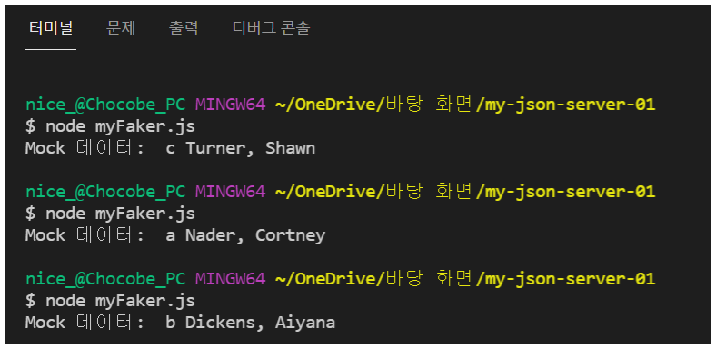<br/>


<br/>

[🔺 Top](#top)

<hr/><br/>


## ``faker.js``의 주요 기능 살펴보기

위에서 만들었던 ``myFaker.js``와 함께 유용한 기능에 대해 알아보겠습니다.


<br/><br/>


## 04-02. ``faker.fake("Mock 데이터 template")`` 메서드

먼저 알아볼 ``faker.js`` 메서드는 ``faker.fake("Mock 데이터 template")`` 입니다.

``fake("Mock 데이터 template")``이 실제 ``Mock 데이터``를 생성하는 메서드 입니다.

인자로 받는 문자열은 ``Mock 데이터 template`` 으로, ``faker.js``에서 제공하는 데이터셋 template을 전달할 수 있습니다.

> ``faker.js`` 데이터셋: [https://github.com/Marak/Faker.js/blob/master/Readme.md#api](https://github.com/Marak/Faker.js/blob/master/Readme.md#api)

<br/>

``template``의 문법은 ``{{메서드명.속성명}}`` 의 형식으로 사용할 수 있습니다.

주의할 점은, ``{{메서드명.속성명}}`` 의 ``콧수염 태그`` 내에 공백문자가 있으면 에러가 발생합니다.

<br/>

만약, ``주소``값 중에서 ``도시명``을 ``Mock 데이터``로 생성하고자 하면 다음과 같이 작성할 수 있습니다.

```javascript
const faker = require("faker");
const cityName = faker.fake("{{address.cityName}}");
```

<br/>

``template`` 에는 복수의 ``Mock 데이터`` 를 조합하여 사용할 수 있습니다.

```javascript
const faker = require("faker");
const fullName = faker.fake("{{name.middleName}} {{name.lastName}}, {{name.firstName}}");
```


<br/><br/>


## 04-03. 생성되는 렌덤값 제어하기 (``faker.seed()``)

``faker.js`` 에서 생성하는 ``Mock 데이터``는 ``Seed``값에 따라 생성 됩니다.

즉, ``Seed``값이 렌덤으로 입력되면, 생성되는 ``Mock 데이터`` 도 ``Seed``에 맞게 렌덤으로 생성 됩니다.

<br/>

다음 코드는 ``faker.seed()``를 사용하여, 특정 ``Mock 데이터`` 를 생성한 예시 입니다.

```javascript
const faker = require("faker");
faker.seed(123);

const cityName = faker.fake("{{address.cityName}}");
```

<br/>

위 코드는 ``seed값``이 ``123``인 ``cityName``을 생성 합니다.

따라서, ``seed``를 명시하게 되면, 렌덤값이 아닌, 특정값을 생성하게 됩니다.


<br/>

[🔺 Top](#top)

<hr/><br/>


##### 05
# 05. ``json-server`` 와 ``faker.js`` 연동하기

기존의 ``json-server``는 직접 작성한 ``JSON``파일 또는 ``Object``로 ``Back End 서버``를 생성 하였습니다.

``json-server``와 ``faker.js``를 연동하면, 우리가 작성한 로직 대로 ``JSON``파일 또는 ``Object``를 생성할 수 있습니다.

따라서, 이 두개의 라이브러리를 연동하면, 좀 더 생산성 높은 ``Mock 서버``를 구축할 수 있습니다.


<br/><br/>


## 05-01. ``faker.js``로 ``Object`` 생성하기 & ``Mock 서버``

이번에 살펴볼 방법은 ``faker.js``를 사용하여, ``Object``를 생성하고, 이 ``Object``로 ``json-server``를 실행할 것입니다.

<br/>

``faker.js``로 생성한 ``Object``를 바로 사용할 것이기 때문에, ``myDB.json`` 처럼 ``JSON`` 파일을 만들 필요가 없습니다.

다음은 예시 코드인 ``myObjectGenerator.js`` 입니다.

```javascript
const _ = require("lodash");
const faker = require("faker");

module.exports = () => {
  return _.times(5, idx => ({
    id: idx,
    name: faker.fake("{{name.middleName}} {{name.lastName}}, {{name.firstName}}"),
    job: faker.fake("{{name.jobType}}"),
    phone: faker.fake("{{phone.phoneNumber}}"),
  }));
};
```

<br/>

위 코드를 작성한 후, CLI에 다음 명령을 실행해 봅니다.

```bash
$ json-server myObjectGenerator.js --watch --port 8010
```

<br/>

실행 결과, 다음과 같은 결과를 볼 수 있습니다.

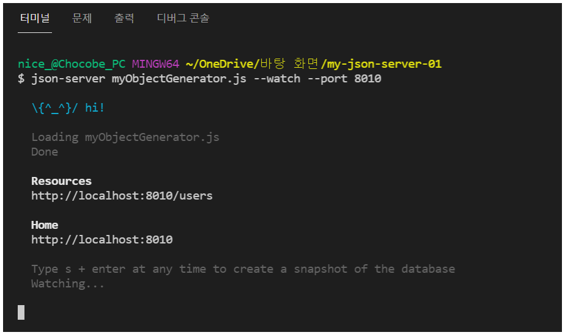<br/>

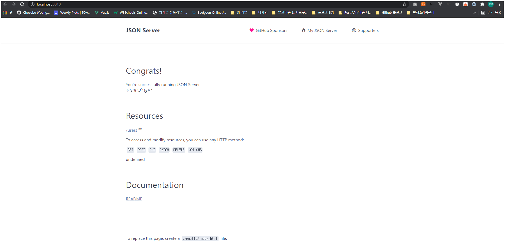<br/>

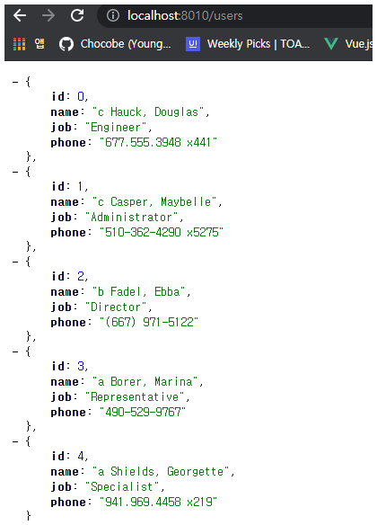<br/>


<br/><br/>


## 05-02. ``faker.js``로 ``myDB.json`` 생성하기 & ``Mock 서버``

이번에는 ``faker.js``로 생성한 ``Mock 데이터``를 ``myDB.json``에 출력한 후, ``json-server``에서 ``myDB.json``을 사용하는 방식으로 작성해 보겠습니다.

이 방법을 사용하게 되면, ``POST``, ``PUT``, ``DELETE`` 등 테이더 조작의 결과가, ``myDB.json``에 반영되기 때문에, ``Mock 데이터``가 유지되는 장점이 있습니다.

<br/>

다음 코드는 ``myFakeGenerator.js`` 입니다.

```javascript
(function() {
  const path = require("path");
  const jsonServer = require("json-server");

  // 사용할 Port 번호
  const PORT = 8020;

  // myDB.json 파일 초기화
  initMyDB();
  
  // 서버 생성
  const server = jsonServer.create();
  // middlewares 생성
  const middlewares = jsonServer.defaults();
  // router 생성
  const router = jsonServer.router(path.join(__dirname, "myDB.json"));

  // middlewares 등록
  server.use(middlewares);
  // router 등록
  server.use(router);

  // JsonServer 실행 상태 출력
  printState(PORT);

  // 서버의 실행 Port 설정 및 실행 완료 callback 설정
  server.listen(PORT, () => {
    console.log("Json Server is running");
  });
})();

// myDB.json 초기화 메서드
function initMyDB() {
  const _ = require("lodash");
  const faker = require("faker");
  const fs = require("fs");

  const users = _.times(3, idx => ({
    id: idx + 1,
    name: faker.fake("{{name.lastName}} {{name.firstName}}"),
    dept: faker.fake("{{commerce.department}}"),
    city: faker.fake("{{address.cityName}}"),
  }));

  const products = _.times(2, idx => ({
    id: 1001 + idx,
    productName: faker.fake("{{commerce.productName}}"),
    price: faker.fake("{{commerce.price}}"),
    brand: faker.fake("{{company.companyName}} {{company.companySuffix}}"),
  }));

  // myDB.json 으로 출력
  fs.writeFileSync("./myDB.json", JSON.stringify(
    {
      users,
      products,
    }
  ));
}

// JsonServer 실행 상태 출력 메서드
function printState(port) {
  console.log("\n*************************************");
  console.log("*                                   *");
  console.log(`*    URL: http://localhost:${port}     *`);
  console.log("*                                   *");
  console.log("*************************************\n");
}
```

<br/>

위에서 작성한 ``myFakeGenerator.js``을 ``Node``로 실행 합니다.

```bash
$ node myFakeGenerator.js
```

<br/>

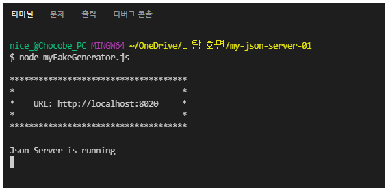<br/>

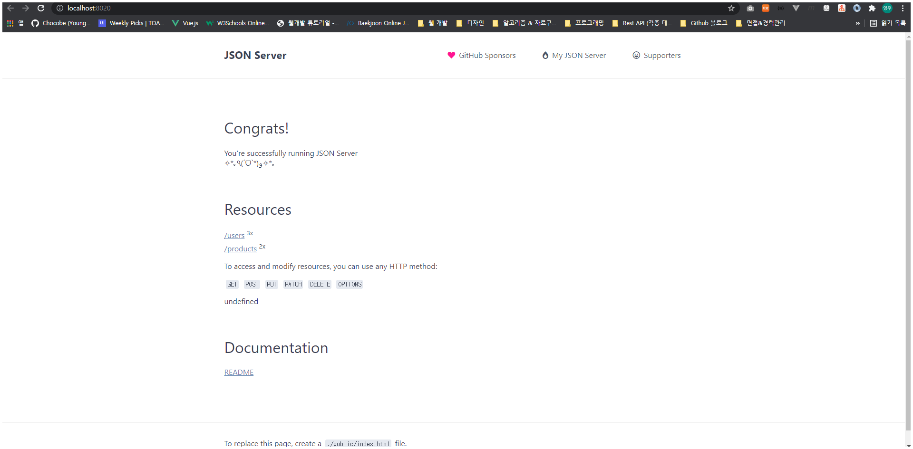<br/>

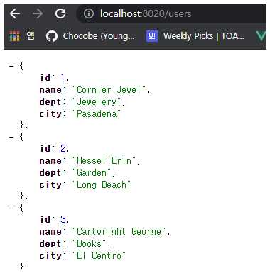<br/>

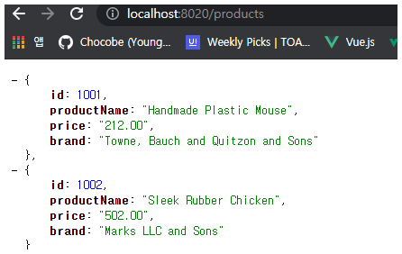<br/>


<br/>

[🔺 Top](#top)

<hr/><br/>


##### 06
# 06. ``POST``, ``PUT``, ``DELETE`` 요청하기

위의 챕터에서 만든 ``Json Server``를 사용하여, ``POST``, ``PUT``, ``DELETE`` 요청을 해 보겠습니다.

(각 Rest API 요청을 위해, ``Postman``을 사용하였습니다.)


<br/><br/>


## 06-01. ``POST`` 요청

``POST`` 요청은 다음과 같이 실행할 수 있습니다.

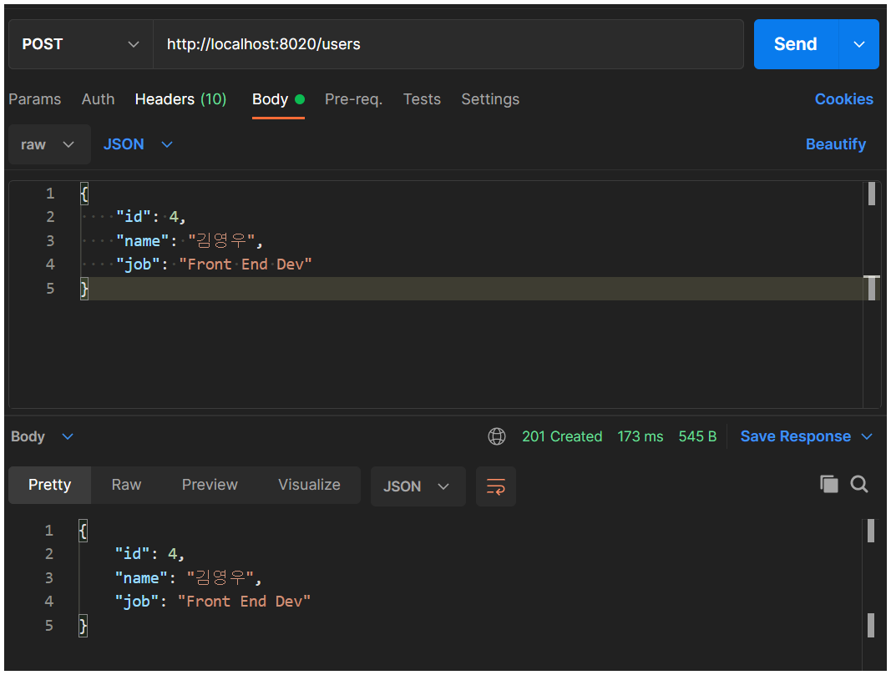<br/>

<br/>

실행 결과, ``myDB.json`` 에도 데이터가 반영됨을 확인할 수 있습니다.

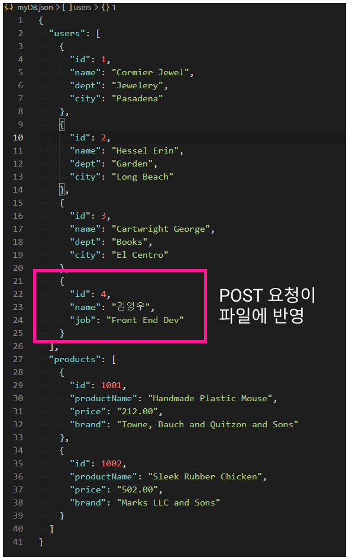<br/>


<br/><br/>


## 06-02. ``PUT`` 요청

``PUT`` 요청은 다음과 같이 실행할 수 있습니다.

<br/>

<br/>

실행 결과, ``myDB.json`` 에도 데이터가 반영됨을 확인할 수 있습니다.

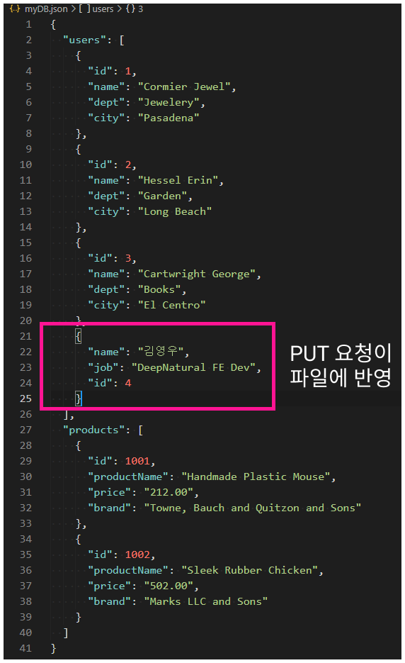<br/>


<br/><br/>


## 06-03. ``DELETE`` 요청

``DELETE`` 요청은 다음과 같이 실행할 수 있습니다.

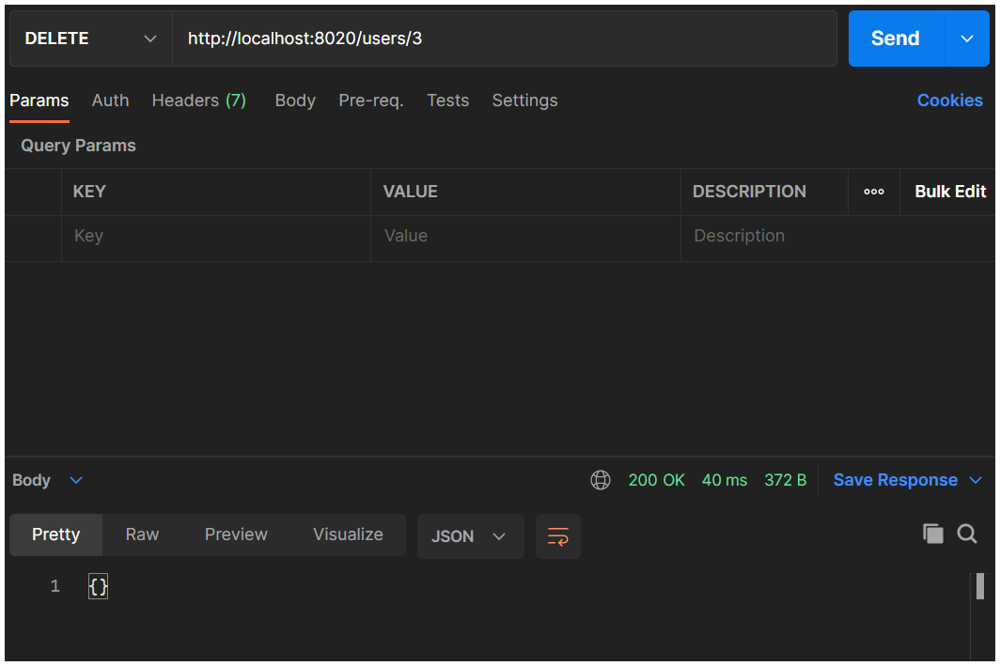<br/>

<br/>

실행 결과, ``myDB.json`` 에도 데이터가 반영됨을 확인할 수 있습니다.

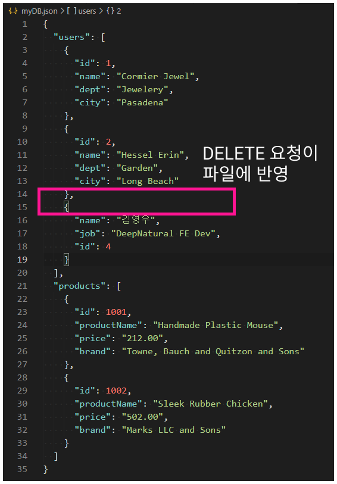<br/>


<br/>

[🔺 Top](#top)

<hr/><br/>
